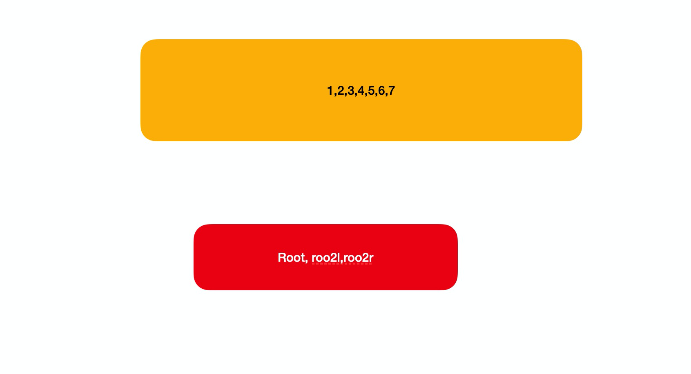

<!--
 * @Author: 六弦(melodyWxy)
 * @Date: 2022-03-16 17:37:45
 * @LastEditors: 六弦(melodyWxy)
 * @LastEditTime: 2022-03-16 21:34:38
 * @FilePath: /react18/algorithm/packages/二叉树/README.md
 * @Description: update here
-->

# 二叉树

## 基于数组创建树
基于队列，先进先出，遍历arr，每次index+2，生成队列头部元素的left和right，自顶向下创建。

## 迭代遍历
基于栈结构

